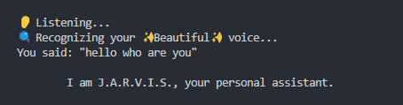
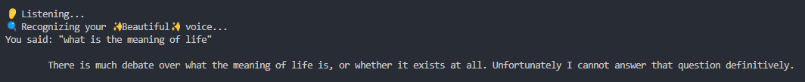
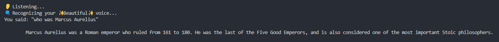
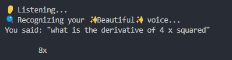

# Virtual Assistant with Python

Experimenting with voice recognition &amp; Text2Speech to create a virtual assistant.

**Note:** 

Examples of virtual assistants you might be familiar with:
* Google Assistant
* Siri
* Amazon Alexa
* J.A.R.V.I.S. (Iron Man)
* Skynet (Terminator)
* HAL 9000 (2001: A Space Odyssey)
* ...

## Examples
Some examples of the voice recognition with the OpenAI response  

It can even solve math problems:  

## Technologies used:
* [OpenAI API](https://beta.openai.com/docs/api-reference/introduction?lang=python) (+ payment plan setup)
  * `pip install openai`
* [Speech Recognition](https://github.com/Uberi/speech_recognition) (Google)
  * `pip install pyaudio` (for microphone input)
  * `pip install SpeechRecognition`
  * You need **FLAC encoder** (only required if your system is not x86-based Windows/Linux/OS X)
* [Offline Text2Speech](https://github.com/nateshmbhat/pyttsx3) (male/female voice)

## Future TODOs
- [ ] Create my own NLP network (Natural Language Processing) for voice recognition